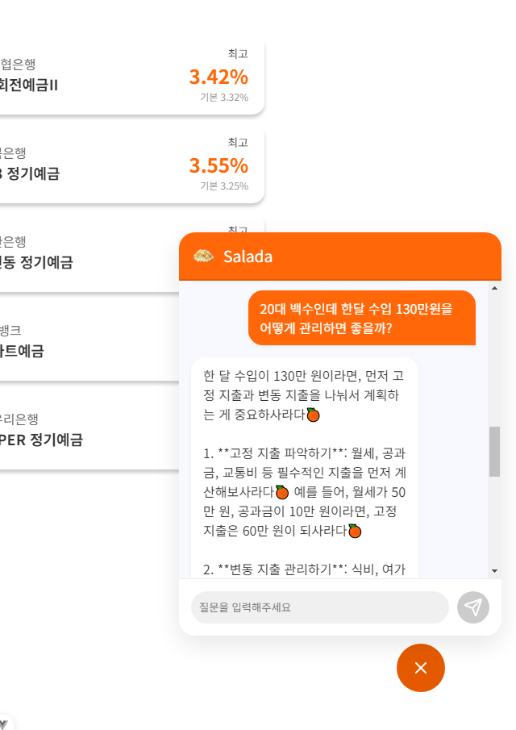

# bankproject

### 금융 상품 비교 애플리케이션

### 목차

1. [🙋 팀원 정보 및 업무 분담 내역](#팀원-정보-및-업무-분담-내역)
2. [📊 설계 내용 (아키텍처 등) 및 실제 구현 정도](#설계-내용-아키텍처-등-및-실제-구현-정도)
3. [📑 데이터베이스 모델링(ERD)](#데이터베이스-모델링erd)
4. [💻 금융 상품 추천 알고리즘에 대한 기술적 설명](#금융-상품-추천-알고리즘에-대한-기술적-설명)
5. [💁 서비스 대표 기능들에 대한 설명](#서비스-대표-기능들에-대한-설명)
6. [🙇 느낀 점, 후기 등](#느낀-점-후기-등)

## 팀원 정보 및 업무 분담 내역

- 프로젝트 기간 : 2023/11/18 ~ 2023/11/27 (약 9일)

| 이름          | 역할 및 구현 기능                                                                                                                             |
| ------------- | --------------------------------------------------------------------------------------------------------------------------------------------- |
| 김선명 (팀장) | Front End - figma, 회원가입, 로그인, 마이페이지, 홈, 금융 상품 비교, 환율 계산기, 주변 은행 검색, 게시판 CRUD, 상품 관리, 상품 추천           |
| 김진실        | Back End - ERD, 유저 CRUD, 커뮤니티 CRUD, 금융 상품 데이터(네이버), 추천 알고리즘 (더미데이터 생성), 환율 데이터(한국수출입은행, 네이버), 챗봇 |

## 설계 내용 (아키텍처 등) 및 실제 구현 정도

### 🖥 기술 스택

**🌕 front**

- language
  - javascript
- framework
  - Vue3
  - pinia (+pinia-plugin-persistedstate)
  - axios
  - chart.js

**🌑 back**

- language
  - python
- framework
  - django
  - django-rest-framework
  - dj-rest-auth
  - pillow
  - drf-spectacular

### 🎨 Figma

[**🔗 Figma Link**](https://www.figma.com/design/OXOygfoSCSRhi6z9zKahw0/Untitled?node-id=0-1&t=PuoAi7xxlDJCYQou-1)

- 예, 적금 금리 비교, 환율 계산, 집 주변 은행 검색, 금융 상품 연동하기, 게시판 등의 필수 기능, 셀렉트 박스를 통해 은행 검색 시 해당 은행의 로고 및 전화번호, 위치, 영업시간 정보 제공. 네이버 환율 그래프 카드 및 redirect, 회원가입 & 로그인 유효성 검사, 프로필 페이지 내 금융 상품 이자율 시각화 기능을 구현함.

## 데이터베이스 모델링(ERD)

[**🔗 ERD drawio Link**]

### 🗂️ API 명세서

## 금융 상품 추천 알고리즘에 대한 기술적 설명

### 추천 알고리즘

**5000명의 사용자 더미데이터**를 생성하여 사용자 유사도를 기준으로 금융 상품을 추천하였습니다.

사용자 유사도는 나이, 저축 목표, 기간, 금액을 기준으로 판단하였고,
유사한 사용자들이 많이 가입한 예적금 상품을 금리 순으로 추천하였습니다.

로그인 하지 않았을 경우에는 전체 사용자가 많이 가입한 예적금 상품을 추천합니다.

## 서비스 대표 기능들에 대한 설명

### 1️ 메인 페이지

- 금융 상품을 카드로 만들어 메인 페이지를 꾸몄습니다. 또한 페이지 전체에 Slider 애니메이션을 추가하였습니다. Slider가 되는 속도에 맞춰 금융 상품 정보를 담은 카드 또한
  회전 되며 보여지도록 했습니다.

### 2️ 로그인, 회원가입 페이지

- 로그인 실패 시 에러메세지를 띄워 사용자로 하여금 아이디와 비밀번호를 다시 확인할 수 있오록 하였습니다.
- 회원가입 시 ID는 이메일 형식, 생년월일은 체크박스를 선택할 수 있도록 구현하였습니다. 또한 윤달, 홀수와 짝수 달의 최대 일 수를 다르게 하였습니다.
- 비밀번호는 8~16자의 영어 대소문자, 숫자, 특수문자로 이루어져 있는지게 하였고, 유저 경험을 향상시키기 위해 비밀번호 입력란 밑에 안내 문구를 작성하였습니다.

### 3️ 마이페이지

- 마이페이지에서 내가 현재 가입한 금융 상품, 그리고 나의 저축 목표와 맞는 금융 상품을 추가적으로 추천 받을 수 있습니다.
- 내 정보 수정하기에서는 회원가입 시 등록했던 정보를 수정하여, 다양한 금융 상품을 추천 받을 수 있는 기회를 넓혔습니다. 예를 들어 저축 목표를 수정하였을 때,
  변경된 저축 목표에 맞추어 금융 상품이 추천 됩니다.
- 비밀번호 변경의 경우, 버튼을 눌렀을 때만 창이 생성되는 기능을 구현하였고, 원하는 내용만 수정할 수 있도록 하였습니다. 이름이나 email, 생년월일 등
  유저를 식별하는 데 필요한 필수적인 정보는 고정된 값만 보여줌으로써, 데이터베이스에 대한 안전성을 높였습니다.

### 4️ 금융 상품 상세 페이지

- 추천된 금융 상품을 클릭함으로써 상품에 대한 상세 정보를 확인할 수 있습니다.
- 공식홈에서 더 알아보기 기능을 통해 해당 금융 상품 페이지로 이동할 수 있도록 했습니다.

### 5 환율 계산 페이지

- 환율 계산 페이지에서는 바인딩을 통해 국가를 선택하고, 금액을 입력하면 원화로 변경된 값을 실시간으로 확인할 수 있도록 구현했습니다.
- 각 국가별 환율 변동 차트를 시각화 하여 제공하여 유저의 편의성을 높였습니다.

### 6 주변 은행 검색 페이지

- 주변 은행 검색 페이지에서는 직접 광역시/도, 시/군/구를 선택하여 장소를 지정할 수도 있습니다. 이 후 범위내 위치한 은행의
  상세정보(지점명, 전화번호, 영업시간)를 함께 확인할 수 있습니다.
- 우측 리스트에 나열된 은행을 클릭하면 지도의 출력 범위가 자동으로 확대되어 정확한 위치를 보다 쉽게 확인할 수 있도록 하였습니다.

### 7 금융 상품 자유 게시판

- 인증된 사용자들(로그인 된) 사용자들끼리 커뮤니티를 형성할 수 있도록 금융 상품 자유 게시판을 제공합니다. (비로그인 회원은 조회만 가능합니다.)
- 기본적인 게시물 CRUD와 댓글 CRUD를 제공합니다.
- 게시글 목록을 확인하기 위해 뒤로가기 버튼을 눌러야 하는 것이 아닌, 게시글의 리스트와 게시글 상세 페이지를 동시에 보여줌으로써 편의성을 높였습니다.
- 하트 아이콘으로 표현된 좋아요 기능을 추가하였습니다. 클릭시 하트가 확대되는 애니메이션을 구현하였습니다.

### 8 챗봇

- 금융 목표를 가진 대한민국 20-30대 청년들을 돕는 금융 전문 챗봇으로, 사용자가 금융 지식 부족으로 인해 겪는 어려움**을 해결하고, 자산 관리를 도와줍니다.
- 금융 챗봇인 만큼 공신력 있고 정확한 정보를 제공하여 사용자들의 금융 목표 달성을 지원합니다.

## 느낀 점, 후기 등

- 김선명 : 백엔드를 맡아준 팀원이 성실한 자세로 프로젝트에 임해준 덕분에 계획 했던 UI/UX를 만족스럽게 구현할 수 있었습니다.
  그에 비해 저는 부족한 모습을 보여 미안하고, 고생 많았다는 말을 전하고 싶습니다. 굉장히 즐겁고, 의미있는 시간이었습니다.
  관통 프로젝트를 진행하면서 Vanila Javascript에 대한 지식이 부족하다는 것을 많이 느꼈습니다.
  부족한 부분은 추후 토이프로젝트를 꾸준히 진행하며 보충할 계획입니다.

- 김진실 : 프론트에서 디자인을 너무 잘해줘서 그것을 다 구현할 수 있도록 노력했습니다.
  처음 생각했던 것보다 하나하나의 기능을 '원하는 대로' 구현하는 것에 시간이 많이 들어 힘든 과정이었지만, 팀원과 함께 힘듦을 나누며 프로젝트를 진행해 너무 감사했습니다.
  부족한 체력을 보강해서 2학기 때에는 더 완성도 높은 프로젝트를 구현할 수 있도록 노력하겠습니다.
